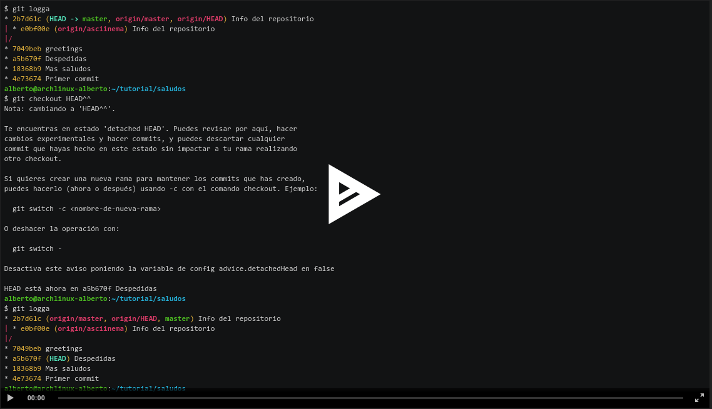

# Cursillo de git

Introducción al control de versiones git

## Contenido

- [Que es un control de versiones](control-versiones.md)
- [Que es git](git.md)
- [Instalando git](instalar.md)
- [Configurar git](config.md)
- [Crear un commit](crear-commit.md)
- [Hacer un cambio](segundo-commit.md)
- [Ver un cambio](diff.md)
- [Hacer una rama](crear-rama.md)
- [Ver cambios en una rama](diff-ramas.md)
- [Mezclar cambios](merge.md)
- [Reescribir la historia: Hacer rebase](rebase.md)

## Diapositivas

## Tutorial del curso

En este repositorio se puede seguir el tutorial sobre git, commits, log, branches:

https://github.com/makersasturias/cursillo-git

En esta grabación se muestra como clonar el repositorio para empezar a colaborar

Este es el repositorio con ejemplos de Pull Request:

https://github.com/makersasturias/makersasturias-git/pulls

